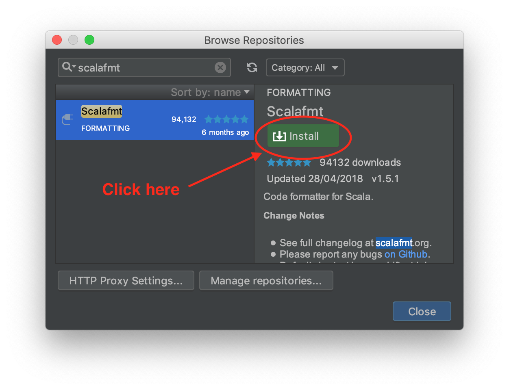
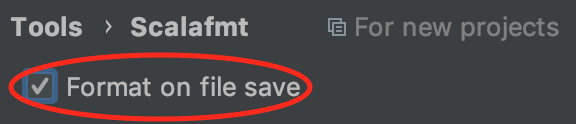
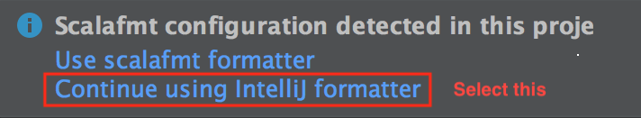

## Why not Scalariform?

[Scalariform](http://scala-ide.org/scalariform/) does an excellent job of
tidying up common formatting errors. However,

- Scalariform does not have a `maxColumn` setting, which I personally like and
  is present in many popular coding styles.
- Scalariform preserves most line breaking decisions, leaving it up to you (or
  even worse, your colleagues) to choose a formatting layout. Scalafmt takes
  liberty to add/remove newlines, making your entire codebase look consistent.

Finally, scalafmt is my Master's thesis project. I thought it would be a fun
challenge to write a code formatter :)

## Why is scalafmt so slow?

My benchmarks show that scalafmt is for most common cases around 4-6x slower
than scalariform (btw, scalariform is already impressively fast). This means
that formatting your average 1.000 LOC file on modern hardware will take around
200ms, which should still feel close enough to instant.

The main feature that makes scalafmt slower than scalariform is the column-width
limit. To figure the "best" way to break a long line, Scalafmt may try thousands
of different formatting solutions.

I am sure that scalafmt could benefit greatly from micro optimizations. Any help
here is appreciated.

## Code formatters create unnecessary diffs!

That's not a question, but I agree that code formatters like scalafmt do
sometimes increase the size of diffs in code reviews. I still believe it's worth
it, considering

1.  Proper formatting helps you catch bugs!

2.  You can enable non-whitespace diffs during code review. For GitHub, add
    `?w=1` to the URL to ignore whitespace changes.

3.  `git blame` has a `-w` flag to ignore whitespace changes so you can still
    blame your colleagues for their crappy code.

4.  code is read waaay more often outside of code reviews, for example when you
    are actually coding.

## Which configuration options minimize diffs/conflicts in version control?

- `align.preset=none` If alignment is enabled a renaming of one entity can impact the
  indentation of other entities.

- `danglingParentheses.preset=true` Having the closing parentheses on the same line as
  the last argument makes the diff line include the parentheses and everything
  following it in case that argument is renamed. So, technically this does not
  reduce the number of diff lines, but the length of them.

## Is the formatting output stable between releases?

No, the formatting rules will evolve even between PATCH releases. I recommend
you inspect the diff for **every** scalafmt update.

## How can I work with older versions of IntelliJ?

If for some reason you cannot use IntelliJ 2019.1 or later (e.g. licensing),
the legacy documentation below describes how to use the dedicated scalafmt
plugin when IntelliJ did not support dynamic scalafmt versions, or did not
directly support scalafmt at all.

> ⚠️ Do **not** follow this answer if you use a current version of IntelliJ, see
> [the main installation page](installation.md#intellij) instead.

To install the
[Scalafmt IntelliJ plugin](https://plugins.jetbrains.com/plugin/8236-scalafmt):

- open `Preferences > Plugins` (for Windows/Linux it is called `Settings`
  instead of `Preferences`)
- open `Browse repositories` (or the `Marketplace` tab in later versions)
- search for `scalafmt`
- click "Install"
- restart IntelliJ

### Format current file

- `Cmd + Shift + L` (macOS)
- `Ctrl + Shift + L` (other)

To re-configure the shortcut

- Open `Preferences > Keymap`
- Search for "Reformat with scalafmt"

### Format on save

- for the current project (recommended): `Preferences > Tools > Scalafmt`
- for all new project:
  `File > Other settings > Preferences for new projects > Tools > Scalafmt`

### Install nightly plugin

To try out the latest pending releases for the Scalafmt plugin:

- Visit
  [Scalafmt plugin page](https://plugins.jetbrains.com/plugin/8236-scalafmt)
- Select "nightly"
- Click "Download"
- Open IntelliJ
- Uninstall existing Scalafmt plugin installation, if any
- Select `Preferences > Plugins > "install plugin from disk..."`
- Choose the downloaded `intellij-scalafmt.zip`
- Restart IntelliJ

### Continue using IntelliJ formatter

When prompted whether to "use scalafmt formatter" make sure to select "continue
using IntelliJ formatter"

As long as you have the Scalafmt plugin installed as instructed above you can
still [format current file](#format-current-file) and
[format on save](#format-on-save).

It is not recommended to select "use scalafmt formatter" since the built-in
support provided by IntelliJ has limitations

- it is hardcoded against a single Scalafmt version (v1.5.1 at this time),
  making it difficult to upgrade to new releases.
- it enables undesirable behavior such as formatting expanded snippets (example:
  "implement methods" inspection) with a low column width. Scalafmt is primarily
  designed to format entire text files instead of individual snippets of code.

To reset the formatter to IntelliJ for an existing project that uses the
Scalafmt formatter:

- Open `Preferences > Editor > Code Style > Scala`
- Switch "Formatter" value to "IntelliJ"

It is not possible to reset this setting for all existing projects.
