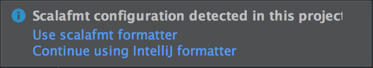

You can use Scalafmt from your editor, build tool or terminal.

## IntelliJ

The _Scala_ plugin compatible with recent versions of IntelliJ IDEA has
_built-in_ support for Scalafmt (see **Note** below). _DO NOT_ install the
deprecated _Scalafmt_ plugin unless you have an older version of Intellij.

When opening a
project that contains [a `.scalafmt.conf` file](configuration.md), you will be
prompted to use it:



Choose the scalafmt formatter and IntelliJ's `Reformat Code` action will then
use Scalafmt when formatting files. See below for shortcuts.

_**Note:** IntelliJ [2019.1 or later] is required in order for the Scala plugin
to support Scalafmt and the dynamic `version` set in your `.scalafmt.conf`. If
you must use an older version, see [the FAQ][old intellij] for an alternative._

[2019.1 or later]: https://blog.jetbrains.com/scala/2019/03/27/intellij-scala-plugin-2019-1-highlighting-for-comprehensions-find-usages-for-implicits-and-more/
[old intellij]: faq.md#how-can-i-work-with-older-versions-of-intellij

### Format current file

- <kbd>Opt + Cmd + L</kbd> (macOS)
- <kbd>Ctrl + Alt + L</kbd> (other)

To re-configure the shortcut:

- Open `Preferences > Keymap`
- Search for "Reformat Code"

#### Range formatting

Scalafmt is primarily designed to operate on entire text files—formatting
selected ranges of code may produce undesirable results. For this reason,
IntelliJ uses its own formatter for ranges by default. It is not recommended to
change this, and is instead recommended to format files when saving.

### Format on save

- for the current project (recommended):
  `Preferences > Editor > Code Style > Scala`
- for all new projects:
  `File > Other Settings > Preferences for New Projects… > Editor > Code Style > Scala`


### Resume using IntelliJ formatter

To reset the formatter to IntelliJ for an existing project that uses the
Scalafmt formatter:

- Open `Preferences > Editor > Code Style > Scala`
- Switch "Formatter" value to "IntelliJ"

It is not possible to reset this setting for all existing projects.

## VS Code

You can use the [Metals](#metals) language server to format code with Scalafmt
in VS Code. For more details, refer to the
[Metals documentation](https://scalameta.org/metals/docs/editors/vscode.html).

## Vim

You can use the [Metals](#metals) language server to format code with Scalafmt
in Vim and NeoVim. For more details, refer to the
[Metals documentation](https://scalameta.org/metals/docs/editors/vim.html).

## Emacs

You can use the [Metals](#metals) language server to format code with Scalafmt
in Emacs. For more details, refer to the [Metals
documentation](https://scalameta.org/metals/docs/editors/emacs.html).

The externally maintained
[format-all](https://github.com/lassik/emacs-format-all-the-code) extension to
Emacs also supports scalafmt as one of its formatters.

## Sublime Text

You can use the [Metals](#metals) language server to format code with Scalafmt
in Sublime Text. For more details, refer to the
[Metals documentation](https://scalameta.org/metals/docs/editors/sublime.html).

## Eclipse

You can use the [Metals](#metals) language server to format code with Scalafmt
in Eclipse. For more details, refer to the
[Metals documentation](https://scalameta.org/metals/docs/editors/eclipse.html).

## Metals

[Metals](https://scalameta.org/metals/) automatically uses Scalafmt to respond
to formatting requests from the editor, according to the configuration defined
in `.scalafmt.conf`.

In most editors, if you there is no `.scalafmt.conf`, upon receiving the first
format request Metals will create the `.scalafmt.conf` file for you.

You can find more information on triggering a format request for individual
editors in their respective parts of the
[Metals site](https://scalameta.org/metals/docs/editors/overview.html).

## sbt

NB: keep in mind that versions of `scalafmt-core` and `sbt-scalafmt` are released
independently, their versions do not align. The version of `scalafmt-core` is defined
in the `.scalafmt.conf` configuration file and downloaded dynamically.

```scala
// In project/plugins.sbt. Note, does not support sbt 0.13, only sbt 1.x.
addSbtPlugin("org.scalameta" % "sbt-scalafmt" % SBT_PLUGIN_VERSION)
```

Latest published version of the sbt plugin:
[](https://index.scala-lang.org/scalameta/sbt-scalafmt/sbt-scalafmt)

To configure the scalafmt version add the following line into `.scalafmt.conf`:

```
version = @STABLE_VERSION@
```

### Task keys

- `myproject/scalafmt`: Format main sources of `myproject` project
- `myproject/Test/scalafmt`: Format test sources of `myproject` project
- `scalafmtCheck`: Check if the scala sources under the project have been
  formatted.
- `scalafmtSbt`: Format `*.sbt` and `project/*.scala` files.
- `scalafmtSbtCheck`: Check if the files have been formatted by `scalafmtSbt`.
- `scalafmtOnly <file>...`: Format specified files listed.
- `scalafmtAll` or `scalafmtCheckAll`: Execute the `scalafmt` or `scalafmtCheck`
  task for all configurations in which it is enabled (since v2.0.0-RC5)

### Settings

- `scalafmtConfig: File`: The location of the `.scalafmt.conf` configuration
  file. Defaults to the `.scalafmt.conf` file at the root of the project.
- `scalafmtOnCompile: Boolean`: Defines if the sbt-scalafmt should run scalafmt
  on compile. Default `false`.
  - ⚠️ This option is **discouraged** since it messes up undo buffers in the
    editor and it slows down compilation. It is recommended to use "format on
    save" in the editor instead.
- [since v2.4.5] `scalafmtFilter: String` (default `""`): optionally limits the
  set of files considered for formatting:
  - `diff-dirty`: only the files modified in the git working tree (`git status`)
  - `diff-ref=<spec>`: only the tracked files modified since `<spec>` (`git diff`)
  - [since v2.4.6] `none`: no restrictions
  - otherwise if `project.git = true` (`.scalafmt.conf`): only files
    tracked by git (`git ls-tree`)
  - otherwise, no restrictions
- [since v2.4.3] `scalafmtDetailedError: Boolean`: if set, when handling a specific error
  (whether logging or throwing an exception), include the stacktrace as well
- [since v2.4.5] `scalafmtLogOnEachError: Boolean`: if set, plugin will log errors
- [since v2.4.5] `scalafmtFailOnErrors: Boolean`: if set, plugin will fail on errors
  - depending on `scalafmtLogOnEachError`, fail on the first error or only at the end
- [since v2.4.6] `scalafmtPrintDiff: Boolean`: if set, `check` will display the
  differences for incorrectly formatted files

### Enable IntegrationTest

> Unnecessary since v2.4.4.

The sbt plugin is enabled by default for the Test and Compile configurations.
Use `scalafmtConfigSettings` to enable the plugin for integration tests and then
use `it:scalafmt` to format.

```scala
inConfig(IntegrationTest)(org.scalafmt.sbt.ScalafmtPlugin.scalafmtConfigSettings)
```

### Share configuration between builds

To share configuration across different sbt builds, create a custom sbt plugin
that generates `.scalafmt-common.conf` on build reload, then include the
generated file from `.scalafmt.conf`

```scala
// project/MyScalafmtPlugin.scala
import sbt._
object MyScalafmtPlugin extends AutoPlugin {
  override def trigger = allRequirements
  override def requires = plugins.JvmPlugin
  override def buildSettings: Seq[Def.Setting[_]] = {
    SettingKey[Unit]("scalafmtGenerateConfig") :=
      IO.write(
        // writes to file once when build is loaded
        file(".scalafmt-common.conf"),
        "maxColumn = 100".stripMargin.getBytes("UTF-8")
      )
  }
}
```

```
// .scalafmt.conf
include ".scalafmt-common.conf"
```

### Limit parallelism

You can limit formatting parallelism for projects with multiple subprojects in your `build.sbt`:

```scala
import org.scalafmt.sbt.ConcurrentRestrictionTags

Global / concurrentRestrictions += Tags.limit(org.scalafmt.sbt.ConcurrentRestrictionTags.Scalafmt, 4)
```

## CLI

The recommended way to install the scalafmt command line tool is with
[Coursier](#coursier).

### Coursier

<div class="sidenote">
To install Coursier see
<a href="https://get-coursier.io/docs/cli-installation" target="_blank">here</a>
</div>

#### install

If you're using a recent version of `coursier` which supports direct
[installation](https://get-coursier.io/docs/cli-overview.html#install)
of packages, the simplest approach is by running

```sh
cs install scalafmt
scalafmt --version # should be @STABLE_VERSION@
```

#### standalone

Alternatively, you can create a complete standalone executable (40+ MB in 2022) with:

```sh
coursier bootstrap org.scalameta:scalafmt-cli_2.13:@STABLE_VERSION@ \
  -r sonatype:snapshots --main org.scalafmt.cli.Cli \
  --standalone \
  -o scalafmt
./scalafmt --version # should be @STABLE_VERSION@
```

#### slim

Finally, you can choose to obtain a slim bootstrap script (100+ KB in 2022) instead with:

```sh
coursier bootstrap org.scalameta:scalafmt-cli_2.13:@STABLE_VERSION@ \
  -r sonatype:snapshots --main org.scalafmt.cli.Cli \
  -o scalafmt
./scalafmt --version # should be @STABLE_VERSION@
```

If a `version` is defined in `.scalafmt.conf`, the CLI binary will honor it
by automatically resolving and downloading the corresponding artifacts if it
does not match its own version. Otherwise, it is **recommended** to put this
bootstrap script in your code repository to make sure everyone on your team,
as well as CI, uses the same scalafmt version.

To configure which files to format, see [project](configuration.md#project).

To customize the JVM options, use the Coursier option `--java-opt`, more info
with

```sh
coursier bootstrap --help | grep -A 1 "\-\-java-opt"
```

### Pre-release

Our CI publishes a pre-release version of scalafmt to Sonatype Snapshots on
every merge into master. To use a pre-release, replace @STABLE_VERSION@ with the
version here:

[](https://oss.sonatype.org/content/repositories/snapshots/org/scalameta/scalafmt-cli_2.12/)

If you use coursier to install a pre-release, be sure to include the flag
`-r sonatype:snapshots` so that the artifact can be resolved.

If you use sbt to install a pre-release, be sure to add the following setting:

```scala
resolvers += Resolver.sonatypeRepo("snapshots")
```

### Native image

For macOS and Linux, it's possible to download pre-built GraalVm native binaries
with instant startup and fast performance for short-lived Scalafmt runs.

```sh
VERSION=@STABLE_VERSION@
INSTALL_LOCATION=/usr/local/bin/scalafmt-native
curl https://raw.githubusercontent.com/scalameta/scalafmt/master/bin/install-scalafmt-native.sh | \
  bash -s -- $VERSION $INSTALL_LOCATION
scalafmt-native --help # should show version @STABLE_VERSION@
```

> The native image binaries have the limitation of working only with one version
> of Scalafmt. The native binaries fail when the `version` setting in
> `.scalafmt.conf` does not match the version of the native binary. It's
> recommended to use the JVM binary if you expect to use Scalafmt in multiple
> projects with different Scalafmt versions.

Please see issue [#1569](https://github.com/scalameta/scalafmt/issues/1569) if
you'd like to contribute support for building native images for Windows!

### Nailgun

Nailgun is recommended if you want to integrate scalafmt with a text editor like
vim/Emacs/Atom/Sublime/VS Code.

- Make sure you have a nailgun client installed. For example with
  `brew install nailgun`.
- Create a standalone executable in `/usr/local/bin/scalafmt_ng` with (sudo if
  necessary)

```sh
coursier bootstrap --standalone org.scalameta:scalafmt-cli_2.13:@STABLE_VERSION@ \
  -r sonatype:snapshots -f --main com.martiansoftware.nailgun.NGServer \
  -o /usr/local/bin/scalafmt_ng
scalafmt_ng & // start nailgun in background
ng ng-alias scalafmt org.scalafmt.cli.Cli
ng scalafmt --version # should be @STABLE_VERSION@
```

Nailgun keeps scalafmt running on a local server to avoid the JVM startup
penalty and also so scalafmt can benefit from JIT. This makes scalafmt up to 10x
faster when formatting a single file from the CLI. The downside to Nailgun is
that the setup is complicated and the long-running server needs to be restarted
once in awhile.

### Homebrew

The recommended way to install the scalafmt command line tool is with
[Coursier](#coursier), itself available via Homebrew.

```sh
brew install coursier/formulas/coursier
coursier install scalafmt
scalafmt --version // should be @STABLE_VERSION@
```

If necessary, make sure to follow the Coursier instructions for updating
`$PATH` so that the `scalafmt` binary becomes available in your terminal.

### Arch Linux

You can install scalafmt for Arch Linux from AUR. There is the
[scalafmt-native-bin](https://aur.archlinux.org/packages/scalafmt-native-bin)
package that installs scalafmt binary built with GraalVM. GraalVM native binary
provides instant startup without Nailgun.

```sh
yaourt -S scalafmt-native-bin
scalafmt --version // should be @STABLE_VERSION@
```

### --help

```scala mdoc:passthrough
println(website.plaintext(org.scalafmt.cli.CliArgParser.buildInfo))
```

```scala mdoc:passthrough
println(website.plaintext(org.scalafmt.cli.CliArgParser.scoptParser.usage))
```

### Using custom repositories with CLI

Under the hood, `scalafmt` uses the `scalafmt-dynamic` library and, in turn,
`coursier`, to download the version (of `scalafmt-core`) specified in
`.scalafmt.conf` file.

By default, coursier will download from a few standard repositories (including
sonatype, both public and snapshot). However, if you'd like to use instead some
custom repositories within your environment, please specify them using the
`COURSIER_REPOSITORIES` environment variable.

#### Repository credentials

Additionally, if your repositories require credentials, please specify them
in the [`COURSIER_CREDENTIALS`](https://get-coursier.io/docs/other-credentials)
environment variable.

Keep in mind that `coursier` credential format is not the same as, say, `sbt`,
and since multiple entries are allowed and expected, each requires a unique
prefix of your choosing.

Others have also reported needing to include in their credentials settings such as

```
<prefix>.pass-on-redirect=true
<prefix>.auto=true
```

## Gradle

It is possible to use scalafmt in gradle with the following externally
maintained plugins:

- [spotless](https://github.com/diffplug/spotless/tree/main/plugin-gradle#scalafmt)
- [gradle-scalafmt](https://github.com/alenkacz/gradle-scalafmt)

## Maven

It is possible to use scalafmt in Maven with the following externally maintained
plugin:

- [spotless](https://github.com/diffplug/spotless/tree/main/plugin-maven#scalafmt)
- [mvn_scalafmt](https://github.com/SimonJPegg/mvn_scalafmt)

## Mill

Mill has scalafmt support built-in:

- [scalafmt module](https://mill-build.org/mill/scalalib/linting.html#_autoformatting_with_scalafmt)

## Standalone library

Use the `scalafmt-dynamic` module to integrate with Scalafmt.

```scala
libraryDependencies += "org.scalameta" %% "scalafmt-dynamic" % "@STABLE_VERSION@"
```

First, create an instance of `Scalafmt` and get paths for the file to format
along with it's configuration file.

```scala mdoc:silent
import java.nio.file._
import org.scalafmt.interfaces.Scalafmt
val scalafmt = Scalafmt.create(this.getClass.getClassLoader)
val config = Paths.get(".scalafmt.conf")
val file = Paths.get("Main.scala")
```

Use the `format` method to format a string with the given config and filename.

```scala mdoc
println(scalafmt.format(config, file, "object A  {  }"))
```

### Binary compatibility guarantees

Stable public APIs:

- `org.scalafmt.interfaces` (recommended): pure Java APIs with no external
  dependencies. Can be loaded via the `scalafmt-dynamic` module.
- `org.scalafmt.Scalafmt` (discouraged): old public API that is stable and will
  remain stable but has several limitations.
  - no support for `version` in `.scalafmt.conf`
  - does not respect `project.excludeFilters` in `.scalafmt.conf`
  - doesn't automatically handle `*.sbt` and `*.sc` files
  - no caching of `.scalafmt.conf`

Internal APIs that are subject to binary breaking changes in any release:

- `org.scalafmt.dynamic`: private implementation of `scalafmt-interfaces`. These
  classes can be used via the static method
  `org.scalafmt.interfaces.Scalafmt.create(ClassLoader)`.
- `org.scalafmt.config`: case classes for `.scalafmt.conf` configuration that
  that are only intended for internal usage.
- `org.scalafmt.cli`: private implementation of the command-line interface.

### `*.sbt` and `*.sc` files

It's possible to format `*.sbt` and `*.sc` files.

```scala mdoc
println(scalafmt.format(config, Paths.get("build.sbt"), "lazy    val   x =   project"))
println(scalafmt.format(config, Paths.get("build.sc"), "def  main(  ) = println()"))
```

The `scalafmt` instance automatically picks the correct parser depending on the
provided filename.

### Version handling

By default, the `scalafmt` instance automatically downloads the Scalafmt version
declared in `.scalafmt.conf`. If the `version` setting is not declared, the
original file contents are returned unchanged and an error is reported with
instructions how to fix the problem.

### Error reporting

By default, Scalafmt errors are reported to `System.err`. Extend
`org.scalafmt.interfaces.ScalafmtReporter` to customize error reporting to
handle parse and config errors.

Here is an example how to extend `ScalafmtReporter`.

```scala mdoc:file:scalafmt-dynamic/jvm/src/main/scala/org/scalafmt/dynamic/ConsoleScalafmtReporter.scala

```

Use `withReporter(reporter)` to pass in your custom reporter.

```scala mdoc:silent
import java.io._
import org.scalafmt.dynamic._
val myOut = new ByteArrayOutputStream()
val myReporter = new ConsoleScalafmtReporter(new PrintStream(myOut))
val customReporterScalafmt = scalafmt.withReporter(myReporter)
```

### Project filters

By default, `scalafmt` only formats files that match the
`project.{excludeFilters,includeFilters}` settings in `.scalafmt.conf`. Use
`withRespectExcludeFilters(false)` to disable this behavior.

```scala mdoc:silent
val scalafmtThatIgnoresProjectSettings = scalafmt.withRespectProjectFilters(false)
```

### Alternate repositories and credentials

`scalafmt` uses some default repositories to download the version specified in
`.scalafmt.conf`; these repositories could be hardcoded or potentially specified
via the environment variables.

In order to specify explicit repositories as well, one could use

```scala mdoc:silent
val scalafmtWithRepos = scalafmt.withMavenRepositories(
  "https://repo-1/snapshots",
  "https://repo-2/public"
)
```

In addition, if some of the default or custom repositories require access credentials,
they could be specified via

```scala mdoc:silent
import org.scalafmt.interfaces._

val scalafmtWithCreds = scalafmtWithRepos match {
  case x: RepositoryCredential.ScalafmtExtension =>
    x.withRepositoryCredentials(
      new RepositoryCredential("repo-1", "username", "password")
    )
  case x => x
}
```

This capability was added to the public interface as an extension method, accessible
via a separate sub-interface.

### Clearing resources

Use the `clear()` method to clear up resources of the `scalafmt` instance.

```scala mdoc
scalafmt.clear()
```

### Calling from Java

It's possible to call Scalafmt from Java without depending directly on Scala
libraries.

First, depend on the `scalafmt-interfaces` module, which is a pure Java library
with no external dependencies.

```xml
<dependency>
    <groupId>org.scalameta</groupId>
    <artifactId>scalafmt-interfaces</artifactId>
    <version>@STABLE_VERSION@</version>
</dependency>
```

Next, obtain a classloader with the `scalafmt-dynamic_2.12` classpath.

```java
import java.net.URLClassLoader;
// this package contains only Java APIs.
import org.scalafmt.interfaces.*;

// ClassLoader that shares only org.scalafmt.interfaces from this classloader.
ClassLoader sharedParent = new ScalafmtClassLoader(this.getClass.getClassLoader)

// Jars to org.scalameta:scalafmt-dynamic_2.12:@STABLE_VERSION@ classpath. Obtain
// these from your build tool or programmatically with ivy/coursier.
URL[] jars = // ...
ClassLoader scalafmtDynamic = new URLClassLoader(jars, sharedParent)
```

Finally, create an instance of `Scalafmt` with the `scalafmt-dynamic`
classloader.

```java
Scalafmt scalafmt = Scalafmt.create(scalafmtDynamic)
String formatted = scalafmt.format(config, file, "object A   { }")
```
